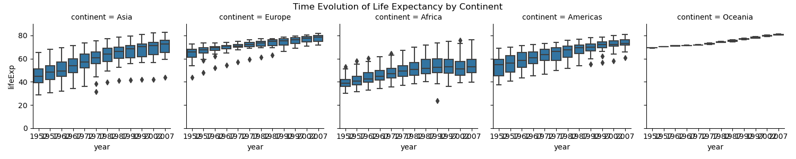
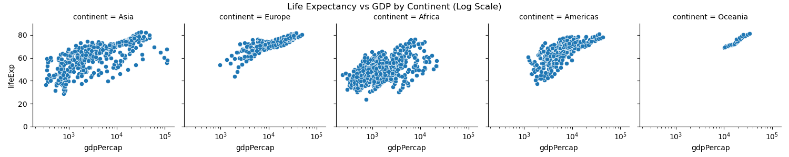
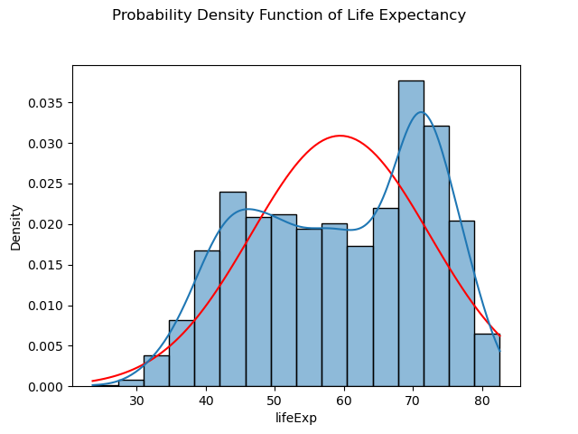

# hw-gapminder

The assignment is comprised of the 4 questions below -- 2.5 points each.

### Data

This assignment uses a subset of the [gapminder dataset](https://www.gapminder.org/data/) 
that is available as "gapminder" in an [R package](https://cran.r-project.org/web/packages/gapminder/README.html).
The "gapminder" dataset in R is dataset available via `library(gapminder); gapminder` in R. 
Do not use the larger dataset that's available in R as "gapminder_unfiltered".
You can get a [text file](https://github.com/jennybc/gapminder#plain-text-delimited-files)
for the gapminder subset directly from the [jennybc github repo](https://github.com/jennybc/gapminder).
The easiest way to get the data into Python is from the text file: 
[gapminder.tsv](https://github.com/jennybc/gapminder/blob/main/inst/extdata/gapminder.tsv)

### Note: if seaborn hangs your mac terminal

For those of us using an older mac...

* For some reason (python not installed as a framework?), plt.show() with seaborn hangs my terminal.  
* Fix this by turning off interactive mode:
```
plt.ioff()
```
* You can also fix this by using a different backend:
```
matplotlib.use('TkAgg')
```
* List all the backends and the current backend with
```
print(plt.get_backend())
print(matplotlib.rcsetup.all_backends)
```
* Or you can add the following to `~/.zprofile` to avoid a hang with the default backend
```
# Avoids seaborn hang on my old macbook pro
export MPLBACKEND=qtagg
```

### FacetGrid

Use Seaborn's FacetGrid for this assignment...

* Seaborn overview
  * [Overview](https://seaborn.pydata.org/tutorial/function_overview.html) -- tutorial introduces “relational”, “distributional”, and “categorical” modules (plot types)
    * [seaborn.displot](https://seaborn.pydata.org/generated/seaborn.displot.html) API reference
  * Seaborn docs: [figure-level vs axes-level functions](https://seaborn.pydata.org/tutorial/function_overview.html)
* "Matplotlib offers good support for making figures with multiple axes"
  * "Seaborn builds on top of this to directly link the structure of the plot to the structure of your dataset."
  * [Mutiplot grids](https://seaborn.pydata.org/tutorial/axis_grids.html) tutorial
* FacetGrid is a seaborn class that enables "faceting"
  * "facet" (the verb) means to look simultaneously at the various dimensions ("facets", the noun) of your dataset
  * [seaborn.FacetGrid](https://seaborn.pydata.org/generated/seaborn.FacetGrid.html) API reference
  * Use the [FacetGrid.set()](https://seaborn.pydata.org/generated/seaborn.FacetGrid.set.html) method to set attributes on each of the subplot axes
  * [scatterplot with continuous hues & sizes](https://seaborn.pydata.org/examples/scatterplot_sizes.html) example
  * [FaceGrid.map_dataframe()](https://seaborn.pydata.org/generated/seaborn.FacetGrid.map_dataframe.html) API reference

## Question 1 -- distribution of life expectancy by continent

Use histograms to visualize the distribution of life expectancy for each continent.
Briefly describe any features that seem significant. 
Make sure your plots are labeled and easy to read. 
Put all the plots in one figure with a title.
Look at the seaborn [FacetGrid API reference](https://seaborn.pydata.org/generated/seaborn.FacetGrid.html)
for data-viz ideas.

To do this, run `make q1`, which produces the following image:

All continents' life expectancies varied from around 40 years to around 80 years, except Oceania, for which all life expectancies were around 80 years.
Oceania has the highest average life expectancy (in addition to the lowest variation), followed by Europe and the Americas. Life expectancies in Asia peaked around 70 years, just like Europe and the Americas, but there was a larger spread, i.e. more instances of lower life expectancies.
Life expectancies were lowest on average in Africa, where they peaked at around 45 years.

## Question 2 -- time evolution of life expectancy by continent

For each continent, use box-and-whisker plots to visualize the time evolution of life expectancy by 
continent (i.e., for each year in the dataset from 1952 to 2007).
Comment briefly on the dominant features you see in the data.
As in Question 2, make sure your plots are labeled and easy to read, and put all the plots in one figure with a title.
Look at the seaborn [FacetGrid API reference](https://seaborn.pydata.org/generated/seaborn.FacetGrid.html)
for ideas.

To do this, run `make q2`, which produces the following image:

All continents' average life expectancies rose steadily from 1952 to 2007. 
Oceania and Europe had the highest average life expectancies in 1952 (around 65 years), and both contintents experienced small but steady growth to around 75 years in 2007.
Asia, the Americas had similar rises in life expectancy. Africa started with the lowest life expectancy, and experienced a slower rise than Asia and the Americas.

## Question 3 -- life expectancy vs GDP

Use scatter plots to visualize the relationship between life expectancy and GDP per capita for each continent.
Compare the use of linear and log scales for GDP. 
Comment on the relationships that seem significant and any outliers you notice.

To do this, run `make q3`, which produces the following images:



All continents' data suggests a positive correlation between GDP per capita and life expectancy. However, there is a significan number of outliers in Asia, where some instances of extremely high GDP per capita (highest in the world) came with average life expectancies, less than a large number of instances of lower GDP per capita.
The data for Africa is least indicative among all continents of a positive correlation between GDP per capita and life expectancy. Notice that while there is a wide range of life expectancies, (25 years to 75 years), the GDP per capita is exclusively below $25,000.
The data suggests that above a GDP per capita of $25,000, there is a slight rise in life expectancy for a rise in GDP per capita.
The linear scale is a better visualization of the correlation between GDP per capita and life expectancy, while the log scale is a better visualization of the variation of GDP per capita among countries.

## Question 4 -- PDF of life expectancy

* Overlay the normal (Gaussian) distribution on a normalized version of the histogram for the entire dataset.
* Include the KDE, which is discussed here: [Kernel Density Estimation](https://seaborn.pydata.org/tutorial/distributions.html#kernel-density-estimation) -- pydata.org
* From ISLR2 p156: kernel density estimator is essentially a smoothed version of a histogram
* Consider using [scipy.stats.norm](https://docs.scipy.org/doc/scipy/reference/generated/scipy.stats.norm.html) -- scipy.org
* Comment briefly on the result (i.e., explain the dominant features in the chart with a few sentences).
  * Make sure to use the results in previous questions to justify your interpretation.

To do this, run `make q4`, which produces the following image:

The distribution of life expectancis appears to be bimodal, with modes at approximately 45 years and approximately 70 years. There is a steady rise from 30 years to 45 years, and a slight dip up till a local minimum of around 60 years, before a sharp rise to the global maximum of around 70 years, followed by a steep fall to 80 years, whose probability is low and similar to 35 years.
The first peak of around 45 years is due to the data for Africa, as well as the early data for Asia.
The global peak of around 70 years is due primarily to data for the Americas, data for Europe and later time period data Asia.